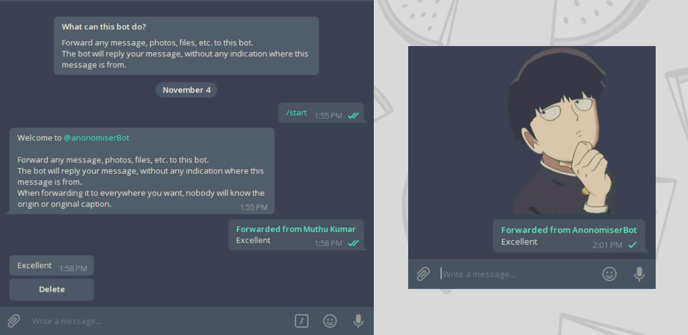

>forward telegram messages anonomously <a href="https://saythanks.io/to/pavanjadhaw" target="_blank"></a> <a href="https://t.me/anonomiserBot" target="_blank"></a>

## Usage

Forward/Send any message, image, sticker, audio, video or document file and this bot will send you the same so that when you forward that one the original authorship on telegram will be remove
and you will be able to share it anywhere.


## Installation

```bash
$ git clone https://github.com/pavanjadhaw/anonymizerbot && cd anonomizerbot

$ npm install
```

Create a config.js file with the following field (You'll need to get a bot API key from [@BotFather](https://t.me/BotFather)):

```JavaScript
module.exports = {
	botApiKey: '94365321:AAGM6_3QK_RC49SA1281zC5U_nmMF',
};
```

Run `npm start`
Try running `/start` in your bot privately.

## Requirements

`nodejs`
`npm`
